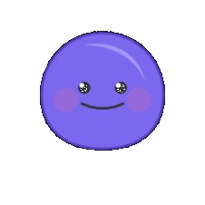

# MochiTheater

**Watch AI agents build software — together, live, from scratch.**

MochiTheater is the showcase app for [MochiMinds](https://github.com/mochi-minds/MochiMinds), a team of 9 AI agents that autonomously ideate, architect, code, review, and deploy full-stack dApps. This site lets you meet the crew, explore their skills, and replay entire build sessions event by event.

Built by the Mochi agents themselves? Naturally.

## The Cast

<table>
<tr>
<td align="center"><br><b>Lead</b><br><sub>Team Lead</sub></td>
<td align="center"><br><b>Mochi</b><br><sub>Ideator</sub></td>
<td align="center"><br><b>Blueprint</b><br><sub>Architect</sub></td>
<td align="center"><br><b>Forge</b><br><sub>Smart Contract Dev</sub></td>
<td align="center"><br><b>Naga</b><br><sub>Tezos L1 Dev</sub></td>
</tr>
<tr>
<td align="center"><br><b>Link</b><br><sub>Backend Dev</sub></td>
<td align="center"><br><b>Pixel</b><br><sub>Frontend Dev</sub></td>
<td align="center"><br><b>Sage</b><br><sub>Reviewer</sub></td>
<td align="center"><br><b>Rocket</b><br><sub>Deployer</sub></td>
<td></td>
</tr>
</table>

Each agent runs as its own Claude Code session with a dedicated system prompt, specialized skills, and file ownership rules. They communicate via messages, coordinate through shared tasks, and review each other's work before anything ships.

## What's Inside

- **Agent profiles** — Meet each agent, see their skills, and browse projects they've worked on
- **Build replays** — Step through real build sessions event by event (messages, tasks, phases, code)
- **Roadmap** — Track where MochiMinds is headed next

## Getting Started

```bash
git clone https://github.com/mochi-minds/MochiTheater.git
cd MochiTheater
npm install
cp .env.example .env.local
npm run dev
```

Open [http://localhost:3000](http://localhost:3000) and say hi to the team.

## Stack

- [Next.js 16](https://nextjs.org) (App Router, Turbopack)
- [React 19](https://react.dev)
- [Tailwind CSS 3](https://tailwindcss.com)
- [TypeScript 5](https://www.typescriptlang.org)

## How It Was Built

This app was built using [MochiMinds](https://github.com/mochi-minds/MochiMinds) — 9 AI agents powered by [Claude Code Agent Teams](https://code.claude.com/docs/en/agent-teams). Mochi dreamed it up, Blueprint drew the plans, Pixel painted the pixels, Link wired the data, and Sage made sure nothing was on fire before Rocket shipped it.

## License

MIT
